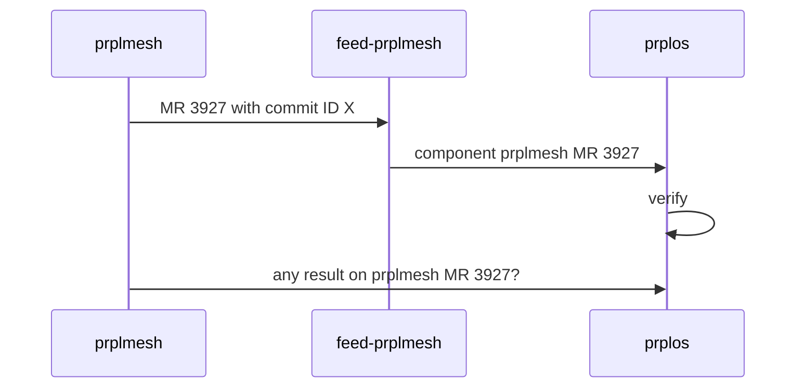

# Automate the component change in prplOS CI

According the the CI integration [workflow](https://prplfoundationcloud.atlassian.net/wiki/x/BYD-Pg) in prplFoundation, when a merge request pushes to the release (main or master etc.) branch of the component, it needs to be tested on system level before it can be merged. To achieve that goal in prplOS, interactions between component, feed, and  prplOS as listed:

1. update the component information to feed
2. update the feed information to prplOS
3. test the component change in prplOS CI
4. use the failed test result as a veto to deny merge request


[TOC]

# graph




## information from component to feed

the minimal information for the feed to **uniquely identify** the component change includes:

* component name, such as `prplMesh` or `libswl`
* component version, such as `c5bb375adc3385a12e3e5b3a6c8843686ad10f` or `v3.9.1`
* component URI, such as `https://gitlab.com/prpl-foundation/prplmesh/pwhm/libraries/libswlc/-/archive/v5.30.4/libswlc-v5.30.4.tar.gz`


the information to help the feed to name the component change in an **predictable and identical** way:

* component merge request identical ID, such as `3927`


the information the help the feed to describe the component change in an **human readable** way:

* merge request target branch hash
* merge request source branch hash

using these two hash, git can generate the human readable message regarding the change.


**All these information are provided by gitlab CI in the form of predefined variables.**


## feed reflects the component change

*minor changes in some feeds are required*

```shell
PKG_REV=$(CI_COMMIT_SHA)
PKG_SOURCE:=libswlc-$(PKG_REV).tar.gz
PKG_SOURCE_URL:=https://gitlab.com/prpl-foundation/prplmesh/pwhm/libraries/libswlc/-/archive/$(PKG_REV)
PKG_HASH:=c5bb375adc3385a12e3e5b3a6c8843686ad10f74fecbe84de13d0d595a83cc4e
```

the branch name in feed should be predictable such as `feed/component/3928`


## information from feed to prplOS

the minimal and adequate information for prplOS to identify the feed change is

*  the revision of feed

for example

```shell
  - name: feed_lcm             
    uri: https://gitlab.com/prpl-foundation/prplos/feeds/feed_lcm.git
    revision: df7c957adf065e8dc64f3df3b08d2147659b3fa3
```

**All these information are provided by gitlab CI in the form of predefined variables.**


## prplOS reflects the feed change

update the `revision` in profiles, in a name predictable branch such as `feed/component/3928`


## step by step in CI

1. prplMesh MR 3927 created on main branch, (after prplMesh build stage) trigger CI Job to start the automatic feeding
2. bot in CI job to create branch `bot/prplMesh/3927`  in `feed-prplmesh` and `prplos`
3. bot in CI job to substitute `Makefile@feed-prplmesh` and then `profile.yml@prplos`, with the commit ID of MR 3927
4. bot in CI Job commit changes to `prplos`
5. `prplos` trigger CI job to test branch `bot/prplMesh/3927` 
6. bot in `prplMesh` CI job poll the `prplos` CI job on branch `bot/prplMesh/3927` to get the test result