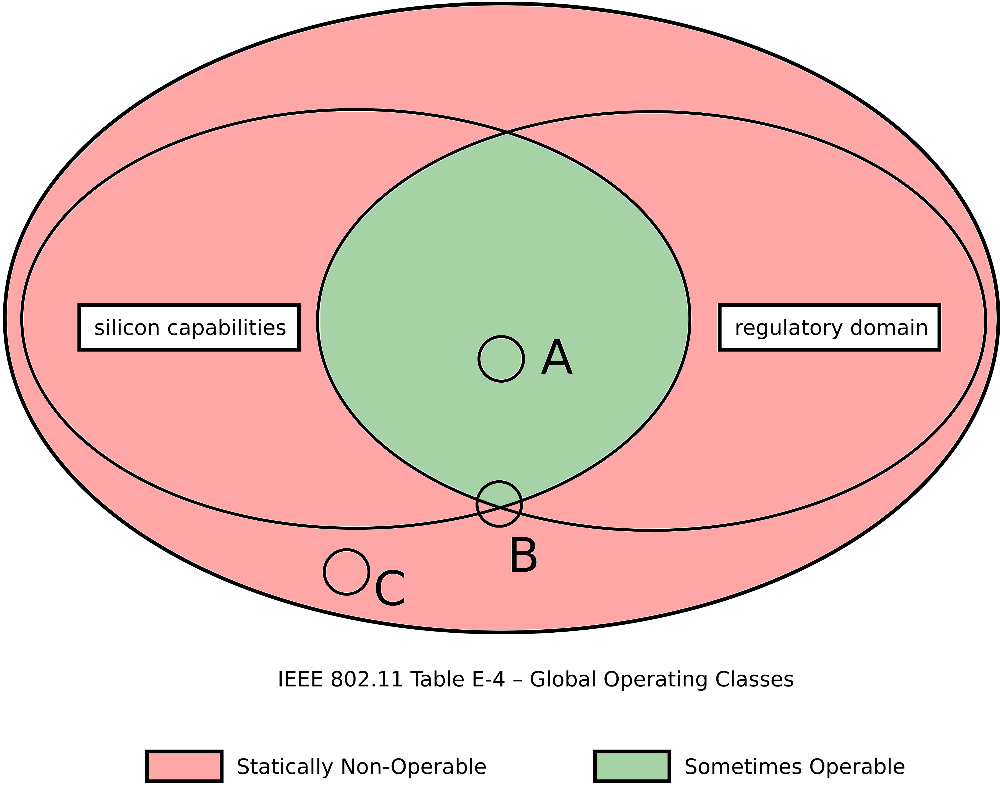
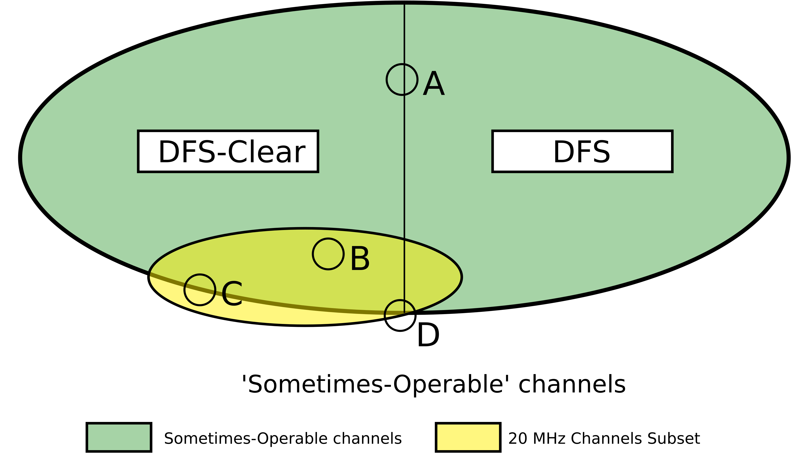

# Introduction

Different lists (sets) of channels can be found in 1905 EasyMesh TLVs. This is an attempt to summarize the inclusion relationships
that exist between these different sets of channels.
The EasyMesh standard references "Table E-4: Global Operating Classes" of the IEEE 802.11 standards as starting point for all channels and operating classes an Agent can use, in other words, table E-4 is the superset of all sets discussed in this document. Inversely, all sets discussed in this document, are subsets of the list of channels from table E-4.

The version of IEEE 802.11 that EM standard references has evolved as follows:

* From R1 to R3, the 802.11 Reference is 802.11-2016.
* From R4 and up, it is 802.11-2020 + 802.11-ax

Note that whereas 802.11-be is not referenced in R6, the 320MHz Operating Class 137 introduced in 802.11-be is supported by prplMesh as of the integration of PPM-3174.

Further down in this document, the version of 802.11 will be omitted, and the Table E-4 will mean whichever version you like.
The exact list of channels is irrelevant, since the rules detailed below apply the same to 802.11-2016, 802.11-2020 and future revisions, for as long as the EM Spec does not introduce changes.


# Messages containing (sub)sets of IEEE802.11 channels

The agent uses subsets of 802.11 Table E-4 {Operating Classes : {Channels}} in the following TLVs (EM Messages):

* AP Radio Basic Capabilities TLV (1905 AP-Autoconfiguration WSC message, AP Capability Report, BSS Configuration Request, Early AP Capability Report)
* Channel Preference TLV
* Operating Channel Report TLV : together with Channel Preference TLV, part of Channel Selection procedure
* Channel Scan Capabilities TLV (present in AP Capability Report, but not present in Early AP Capability Report)
* Channel Scan Request TLV
* Channel Scan Result TLV
* CAC Capabilities TLV (channel availability check)
* CAC Request TLV
* CAC Completion Report TLV
* CAC Status Report TLV : CAC is not yet covered in this document
* Radio Operation Restriction TLV : not yet covered in this document
* Anticipated Channel Preference TLV : not yet covered in this document
* Anticipated Channel Usage TLV : not yet covered in this document

These TLVs can be grouped in three logical groups : 

* Capabilities Reporting : AP Radio Basic Capabilities TLV
* Channel Selection : Channel Preference TLV, CAC-related TLVs, Operating Channel Report
* Channel Scan : Capabilities, Request, Result TLVs

Depending on the TLV, missing channels have implicit properties. These will be discussed in the respective paragraphs.

## 1. Capabilities Reporting

The concept of statically non-operable channel is the cornerstone of channel management in EasyMesh.

The standard itself clarifies the meaning of 'statically' in this context as 'permanently' (non-operable).
(EM-R1:R6 Section 8.1 Channel Preference Query and Report).

Figure 1 shows how A.-silicon restrictions, and B.-regulatory domain restrictions, both define subsets of the channels in Table E-4. The intersection of these subsets constitutes the channels on which the agent is NOT(never able to operate on).
For the remainder of the document, the negation of 'never' is considered to be 'sometimes'.

This brings us to the equation:

> "Permanently Non Operable" + "Sometimes Operable" = Table  E-4  Channels.

that is used by the agent to compute the statically non-operable channels, based on the list of supported channels that PWHM computes and reports (sometimes operable) and the Table E-4 (as discussed above, of a variable version, and prone to evolutions), which is hardcoded in son_wireless_utils.cpp (channels_table_24g, channels_table_5g, channels_table_6g).

that is used by the agent to compute the statically non-operable channels, based on the list of supported channels that PWHM computes and reports ("Sometimes Operable" list) and the Table E-4 (as discussed above: of a variable version, and prone to evolutions), which is hardcoded in son_wireless_utils.cpp ([channels_table_24g](common/beerocks/bcl/source/son/son_wireless_utils.cpp#76), [channels_table_5g](common/beerocks/bcl/source/son/son_wireless_utils.cpp#L163), [channels_table_6g](common/beerocks/bcl/source/son/son_wireless_utils.cpp#L369)).


Some examples of contents for the AP Radio Basic Capabilities TLV are presented in Fig. 1.

 * A . Operating Class has zero non-operable channels : it is present and contains 0 channels : implies all channels of Operating Class are operable in some way (non-DFS) or another (DFS).
 * B . Operating Class has some non-operable channels : it is present and contains the red channels only.
 * C . Operating Class has zero operable channels : it is not present in the TLV.

<p>
	
	<em>Figure 1. Operable Channels as the intersection of subsets (silicon capabilities and regulatory domain allowed channels) of 802.11 Channels.</em>
</p>

## 2. Channel Selection

### Channel Preference TLV

Channel Preference TLVs should contain all operating classes and channels that are 'sometimes operable', i.e. 
'Table E-4 Channels' minus 'Statically Non-Operable Channels', i.e., the green sets as depicted in Fig.1 and Fig.2.

In Fig.2 the 'green' (Operable Channels) are further split into two subsets. DFS-Clear contains both the channels that are exempt of DFS behavior in the current regulatory domain (DFS-clear from the factory), as well as channels cleared by the agent. This was done to illustrate the case A, when one Operating Class has channels in different DFS states. (since an operating class does not typically have different DFS behaviors for the channels it contains).

Some examples of contents for the Channel Preference TLV are presented in Fig.2. :

 * A . Operating Class is present twice in the Channel Preference TLV : once with the cleared channels and an arbitrary preference score, once with the non-cleared channels, with a preference score of ZERO and a reason code 0b1010 : DFS Channel State Unknown.
 * B . Operating Class is present once in the Channel Preference TLV with ZERO channels (preference applies to all channels of the Operating Class), and an arbitrary preference score.
 * C . Operating Class is present once in the Channel Preference TLV with the channels in the green set, and an arbitrary preference score.
 * D . Should never happen : an Operating Class has 1 Bandwdith : it can either be 20MHz or not 20MHz, not both at the same time.
 
Implementation-wise, PWHM reports only 20MHz channels in the list under WiFi.Radio.*.PossibleChannels . The agent computes the full list of Operating Classes / Channels based on this list.

<p>
	
	<em>Figure 2. Operable Channels, and a focus on 20MHz Channels for scanning.</em>
</p>


### Operating Channel Report TLV

Operating Channel Report TLV contains a set of operating classes of decreasing bandwidth, down to the 20MHz {OpClass, Channel} pair that is used for beaconing. The channel(s) reported in this TLV may be subject to radar detection, in which case, it is implied that a  CAC was completed.

### CAC Procedures

Agent has the possibility to perform CAC independently or upon controller request.

## 3. Channel Scan TLVs

When it comes to scanning, a total of 3 TLVs are exchanged between the Agent and the Controller :

```
Agent --> Controller : Channel Scan Capabilities
Agent <-- Controller : {Channel Scan Request} x N
Agent --> Controller : {Channel Scan Result} x M
```

### On Bandwidth


Channel Scan Capabilities TLV is specified to contain ONLY 20MHz Operating Classes from Table E-4.

These channels are expected to be a strict subset of the 'sometimes operable' Channels, implicitly defined by the AP Radio Basic Capabilities TLV. (see Fig.2. for how Channel Scan channels overlap with Operable Channels).

Channel Scan Result TLV definition (section 17.2.40 EM-R6) implies that the channels present in the TLV are 20MHz, based on the definition of: 

* Utilization : The current channel utilization measured by the radio on the scanned 20 MHz channel - as defined in section 9.4.2.28 of [1].
* Noise : An indicator of the average radio noise plus interference power measured on the 20 MHz channel during a channel scan. Encoding as defined as for ANPI in section 11.11.9.4 of [1].

There is no implicit or explicit restriction for the Channel Scan Request TLV. The implementation is free to reply with Status "0x01: Scan not supported on this OpClass / Channel", or break down the requested logical channels into 20MHz channels.


### Channel Scan Capabilities TLV

Channel Scan Capabilities TLV is reporting all 20MHz channels that a radio can scan. In Fig.2., this is the intersection of the green and yellow sets.
In Fig.2., the indicated Operating Classes shall be reported as follows :

 * A . Operating Class not present (not 20MHz).
 * B . Operating Class present in TLV; reports ZERO channels, implying Agent is capable to scan ALL channels (regardless of the DFS state).
 * C . Operating Class present in TLV: contains the channels in the green set only. Agent is not capable to switch the radio to a statically non-operable channel.
 * D . N / A operating class has only one bandwidth.


### Channel Scan Request TLV

In this TLV, the following omissions are possible :

 * If the "Perform Fresh Scan" bit is set to 0, Operating Classes are omitted. The agent shall return the last stored result for all Operating Classes/ Channels specified in the Channel Scan Capabilities TLV.
 * If the "Perform Fresh Scan" bit is set to 1, the TLV contains a list of Operating Classes. For each Operating Class, there is a corresponding list of Channels. If no channels are included, the Agent is required to scan on 'all channels' of this Operating Class (whereas the standard does not specify if 'all channels' refers to Table E-4 or Channel Scan Capabilities, I believe it should be implemented as the former : Channel Scan Capabilities).


### Channel Scan Result

If "Perform Fresh Scan" bit is set to 0, Agent should include a result for all Operating Classes/ Channels in the Channel Scan Capabilities TLV.
If no results are available, the Scan Status should be set to 0x04 : Scan Not Completed. In this case, the TLV is truncated as per the EM specification / yaml definition of Channel Scan Result TLV.
