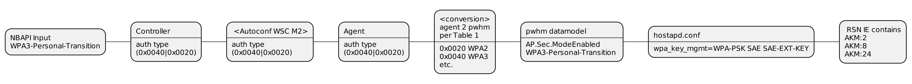
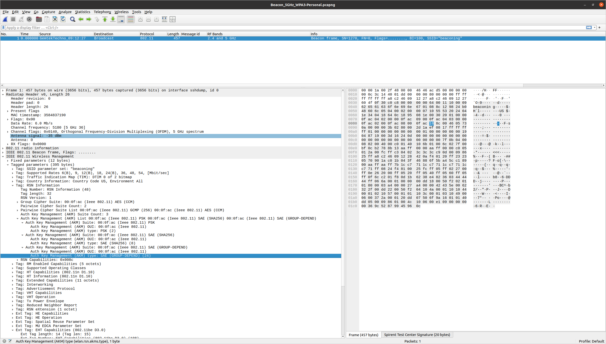
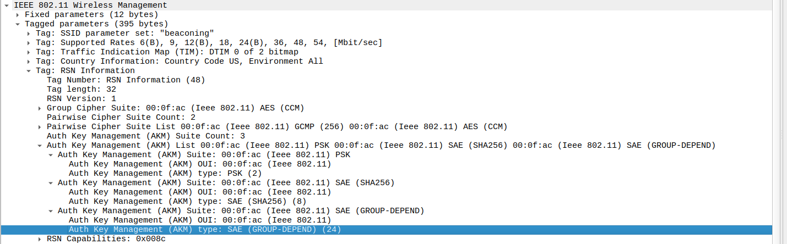
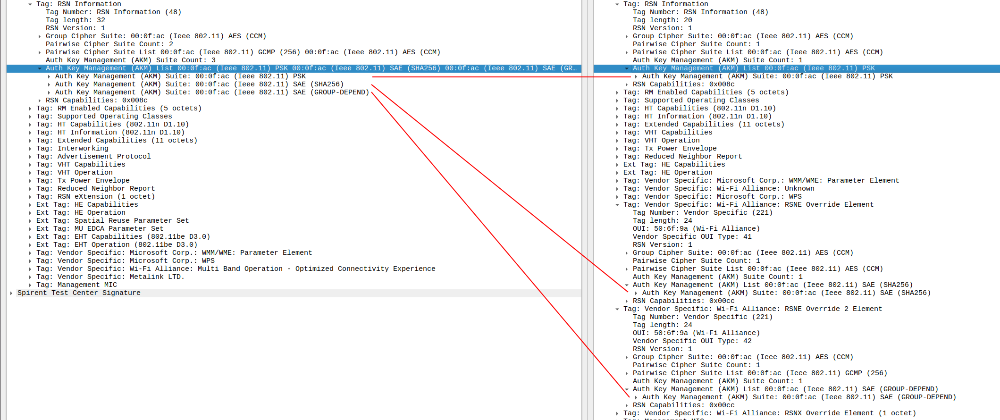
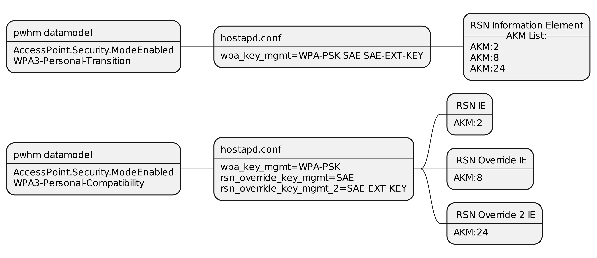
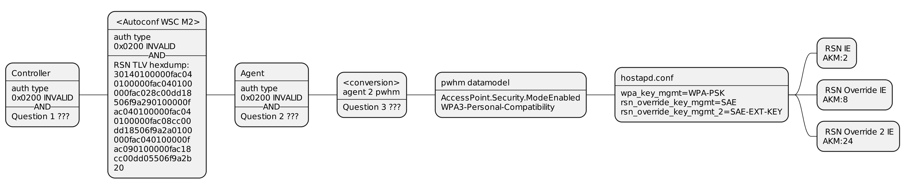
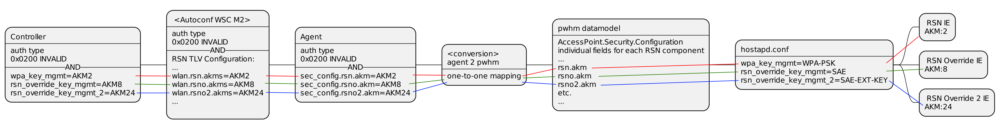

# Introduction

The initial version of EasyMesh relies on the IEEE-1905 configuration mechanism.
IEEE-1905 itself uses the WSC specified data formats to disseminate configuration in the network.

Later versions of EasyMesh add DPP bootstrapping as a means of authenticated and encrypted configuration.

WSC notably does not support transmitting WPA3 in the data structures. EasyMesh extends the "Table 32 – Authentication Types" in "Wi-Fi Protected Setup Specification" with a value for SAE (EM R2). In EM R6, the table is further extended, with the SAE value renamed/ clarified to mean specifically SAE with AMK:8, and new values for DPP AKM and SAE with AKM:24 are added.

| Value | Authentication Type | Notes | Source |
| ---   | ---   | ---   | ---   |
|    0x0001   | Open       | | WPS Specification  |
|    0x0002   | WPA-Personal  | Deprecated in WPS version 2.0 | WPS Specification  |
|    0x0004   | Shared  | Deprecated in WPS version 2.0| WPS Specification  |
|    0x0008   | WPA-Enterprise  | Deprecated in WPS version 2.0 | WPS Specification  |
|    0x0010   | WPA2-Enterprise  | | WPS Specification  |
|    0x0020   | WPA2-Personal  | | WPS Specification  |
|    0x0040   | SAE / SAE with AKM8  | renamed in EM R6 | EM : Added in R2  |
|    0x0080   | DPP AKM  |  |  EM: Added in R6  |
|    0x0100   | SAE with AKM24  |  |  EM: Added in R6  |
|    0x0200   | Invalid type in M2 | The (valid) AKM value(s) are provided in the   RSN Parameters Configuration TLV  | EM: Added in R6.1|

	<em>Table 1. Full contents of EasyMesh Table 16 as of EM R6.1  </em>

### Vocabulary

RSN IE : Robust Secure Network Information Element (a type of Information Element)

WPA3-CM : WPA3 Personal Compatibility Mode, as defined in WPA3 v3.5

Named security modes - classical security modes, where a string non-ambiguously describes the contents of the RSN / RSN Override IEs.
Example: WPA2-Personal, WPA3-Personal, WPA3-Personal-Compatibility.

Anonymous security modes - security mode that is described by enumerating the contents of the RSN / RSN Override IEs alone.

### Brief reminder about how it works now

#### EasyMesh

Values in the first column of Table 16 of EasyMesh are orthogonal (each correspond to one different bit). As such, they are _usable as flags in a bitmask_.
This allows encoding mixed modes as the sum of the corresponding basic modes, for example WPA3-Transition is encoded as the sum of WPA2-Personal and WPA3-Personal :
> 0x0020 + 0x0040 = 0x0060

#### End to end simplified graphical representation

Security modes are _named_ and there is a precise and non-ambiguous equivalence between a value from
[TR-181 security modes](https://usp-data-models.broadband-forum.org/tr-181-2-19-1-usp.html#D.Device:2.Device.WiFi.AccessPoint.Security.ModesSupported), i.e. _the name of a security mode_, and the expected _contents of a IEEE 802.11 RSN I.E_ that are visible in the air.

	
	<em>Figure 1. Propagation of security mode (0x0040|0x0020) from controller to hostapd.conf </em>

In the example above, the Controller reads the security mode from the NBAPI. The conversion between the TR-181 string representation and the EM representation is handled by the NBAPI.
A similar logic is used by bwl for the inverse conversion, from EM representation to a TR-181 string.
Both the controller and the agent implement the Table 1 conversion rules (except for 0x0100 SAE with AKM:24, at the moment of writing).

In pWHM the complicated logic is implemented in the wld_hostapd_cfgFile.c file. The s_setVapCommonConfig() function handles the one-to-many translation between a supported value of the Security.ModeEnabled string and the relevant contents of the hostapd.conf file. For brevity, only the hostapd config that encodes the AKMs is represented.

In hostapd.conf, mixed modes are described as a space-separated concatenation of the basic modes in the corresponding parameters, for example :
> wpa_key_mgmt=WPA-PSK SAE SAE-EXT-KEY

results in RSN IE advertising AKM2, AKM8 and AKM24.

In the air, this looks like so:

	
	<em>Figure 2. WPA3-Personal-Transition with AKM:24 </em>

	
	<em>Figure 3. Zoom : AKM concatenation in the RSN IE </em>

RSN IE contains a AKM _list_ , and the AKMs that are required in hostapd.conf by the wpa_key_mgmt parameter, are concatenated in this list.

## WPA - The Transition Towards Compatibility Mode

#### WPA3 CM in the air

WPA3 Compatibility Mode aims to solve compatibility issues with legacy stations by isolating newer AKMs in separate IEs.
In the air, this looks like shown in Figure 4.

	
	<em>Figure 4. AKMs from RSNE are split in individual RSN IEs </em>

#### RSN Overriding

The mechanism through which AKMs are isolated in individual IEs is called RSN Overriding, and is discussed below.
RSN Overriding defines the RSN Override 1 and RSN Override 2 information elements.
RSN Override IEs are specified as 802.11 vendor-specific IEs, tagged with the WFA OUI, and _encapsulating an 802.11 RSN IE as payload_.
The difference between the two is in the value of the vendor type, 0x29 for Override 1 and 0x30 for Override 2.

|Field | Size (octets) | Value (Hex) | Description |
|--- |--- |--- |--- |
|Element ID | 1 | 0xDD | vendor-specific IE |
|Length | 1 | Variable | Length of following fields |
|OUI | 3 | 0x506F9A | WFA OUI |
|OUI Type | 1 | 0x29/ 0x2A | vendor type : 0x29 or 0x2A (RSNO and RSNO2 respectively) |
|Payload | Variable | Variable | Information field of the RSNE per 9.4.2.24 of 802.11-2020 |

	<em>Table 2. Structure of RSN Override IEs </em>

Per the definition of the RSN Overriding mechanism, **the contents of the {RSN, RSNO, RSNO2} tuple can be arbitrary**, meaning each can be individually configured, meaning {AKM:2, AKM:6, AKM:20} is a valid configuration.

#### WPA3 CM Specification

As discussed above, **the contents of the {RSN, RSNO, RSNO2} tuple can be arbitrary**.
WPA3 CM is an instance of this tuple. The specification describes in detail the contents of every information element.
We shall limit the description to the AKMs that are required for WPA3 CM and copy them below in tables 2 and 3.

|AKM | 802.11 Information Element |
|--- | --- |
|AKM2 | RSN IE |
|AKM8 | RSN Override IE |
|AKM24 | RSN Override 2 IE |

	<em>Table 3. Breakdown of AKMs into separate Information Elements (for 2.4GHz / 5GHz networks)  </em>

For 6GHz networks, AKM2 / WPA2-Personal is not supported and not advertised. Instead, AKM:8 is moved to RSN IE, and the RSN Override IE is dropped.

|AKM | 802.11 Information Element |
|--- | --- |
|AKM2 | Not Advertised |
|AKM8 | RSN IE |
|AKM24 | RSN Override 2 IE |

	<em>Table 4. Breakdown of AKMs into separate Information Elements (for 6GHz networks)  </em>

Further details, for example RSN Capabilities flags or RSNX IEs, are not covered in this documentation.

#### Implementation of RSN Overriding in hostapd

In hostapd, the wpa_key_mgmt is still mapped to the RSN IE. New fields, whose names are in Fig. 5 below, are introduced to configure RSN Override IEs.

	
	<em>Figure 5. hostapd implementation of RSN Overriding </em>

It appears hostapd supports only _named_ AKMs, per table "Table 9-151—AKM suite selectors" from "IEEE802.11-2020". (so it would be difficult/impossible to include  an arbitrary OUI:type AKM in the beacons).
Paradoxically, EM R6.1 and WPA3-CM specifications both reference IEEE802.11-2020, which does not contain the definition of AKM:24.

## WPA3 Compatibility in EasyMesh

Per Table 1., auth type 0x0200 indicates that the Security Configuration is transmitted separately, inside the RSN Parameters Configuration TLV.
The payload of the RSN Parameters Configuration TLV is _a concatenation of RSN Elements as advertised by the VAP in the air_.
The example that is provided in the EasyMesh R6.1 specification contains RSN Override 1 and 2 IEs. with the AKMs for 2.4/5GHz VAPs per WPA3-CM requirements (cross-reference with Table 2 above).

|RSN Override Header | expansion | advertised AKM, hex | advertised AKM, text |
|--- |--- |--- |--- |
|dd21506f9a29 | dd-vendor / 21-length / 506f9a-WFA OUI / 29-RSNO  | 000fac08 | AKM:8 |
|dd1d506f9a2a | dd-vendor / 1d-length / 506f9a-WFA OUI / 2a-RSNO2 | 000fac18 | AKM:24 |

	<em>Table 5. Peeking into the example provided for the RSN Parameters Configuration TLV in EM 6.1 Table 130 </em>

Regardless, EasyMesh R6.1 specification does not mention the name WPA3-CM by name, strongly implying it is _an instance of RSN Overriding_, as previously discussed in this document (RSN Overriding implies arbitrary collections of AKMs).

#### End to end simplified graphical representation for WPA3-CM

Section **Implementation of RSN Overriding in hostapd** , Figure 5, covers the changes in the pwhm-hostapd interaction, that allow to broadcast RSN Override IEs in beacons.
Figure 5 shows the parameters name and values that correspond to the WPA3-CM AKM suites.

Figure 6. shows the end-to-end sequence for configuring WPA3-CM.
The Autoconfiguration WSC M2 message contains auth type 0x0200 and an RSN Parameters Configuration TLV.

	
	<em>Figure 6. Propagation of an arbitrary security mode from controller to hostapd.conf </em>

In Figure 6 above, the hexdump is a copy of one instance of the field called **Security IEs** in EM R6.1 Table 130. The full TLV would contain decorators, like a RUID - to point to one Radio of the Agent, and bss_index, to point to one instance of WSC Config in WSC M2.
Several questions arise as to how to obtain the TLV, on the Controller side, and how to parse it, and store it internally, on Agent side.

Addressing the questions one by one:
 * Question 1. How does the controller build the contents of RSN Parameters Configuration TLV.
 * Question 2. How does the agent parse the contents of the RSN Parameters Configuration TLV and how does the agent represent the result, internally.
 * Question 3. How does the agent interact with pwhm.

###### Question 1 : Building the RSN Parameters Configuration TLV

std::copy_n() function

In the current implementation, the controller holds a statically-allocated buffer, containing a hex dump of the RSN Security IEs formatted according to the WPA3-CM requirements.
When WPA3-CM is pushed, through NBAPI for example, the controller builds the TLV using information from the Agent (RUIDs), and copies the buffer into the RSN Parameters Configuration TLV.

###### Question 2 : Parsing the RSN Parameters Configuration TLV and storing in internal context

std::memcmp()

Since there is a copy of the hex dump that corresponds to WPA3-CM, the agent performs a std::memcmp() between the hex dump and the contents of the TLV.
If the contents match, the agent decides it received the WPA3-CM security mode, and stores it in an extension of the auth_type variable.
In this sense, WPA3-CM is implemented as a _named security mode_ by prplMesh.

###### Question 3 : Interaction with pwhm

Since WPA3-CM is implemented as a _named_ security mode, the Agent writes the "WPA3-Personal-Compatibility" string to the corresponding <nobr>WiFi.AccessPoint.{i}.Security.ModeEnabled</nobr> field.

###### The sum of these abstractions
As a result of these abstractions, WPA3-CM is roughly equivalent to auth-type 0x0200 from Table 1.
I.E. auth type 0x0200 plus one bit of information (bool output of _std::memcmp()_) are used to decide that the security mode is WPA3-CM.
The downside is that any flipped bit in the RSN Parameters Configuration TLV flips the output of _std::memcmp()_, so the current solution is formally not interoperable with other implementations.

The current implementation of WPA3-CM is a simplification that is not sustainable. The idea behind the RSN Configuration mechanism (in the WPA3 specification, and in the EasyMesh specification) is to _drop the named security modes_ in favor of enumerating the contents of the RSN information elements (RSNE, RSNOE, RSNO2E).
One way to see why, is that _every named security mode describes a combination of RSN [RSNO/RSNO2] parameters_ in the air, but not _all combinations of RSN [RSNO/RSNO2] can be named_. The tradeoff is between _named security modes_ :not flexible and not complex, and _anonymous security modes_ :flexible and complex.

## Missing datamodels

Figure 7 shows the ideal propagation of security configuration from the Controller to the Agent, down to hostapd and in the air.
In this model, it is possible to configure arbitrary collections of AKMs.
Corresponding datamodels (NBAPI - for input and PWHM - for output) have not yet been specified. Missing datamodels is the blocking point towards a complete implementation of 17.2.107 RSN Parameters Configuration TLV from EM R6.1.

	
	<em>Figure 7. Propagation of arbitrary security parameters from controller to hostapd.conf </em>

Bonus point if hostapd drops naming the AKMs (for example : WPA-PSK for AKM:2, SAE for AKM:8). Per Figure 7, the OUI:type notation is already used by the 802.11 frames (beacons and probe responses), and is expected to be used by the RSN Parameters Configuration TLV, so it makes sense to use it everywhere in the configuration chain.
