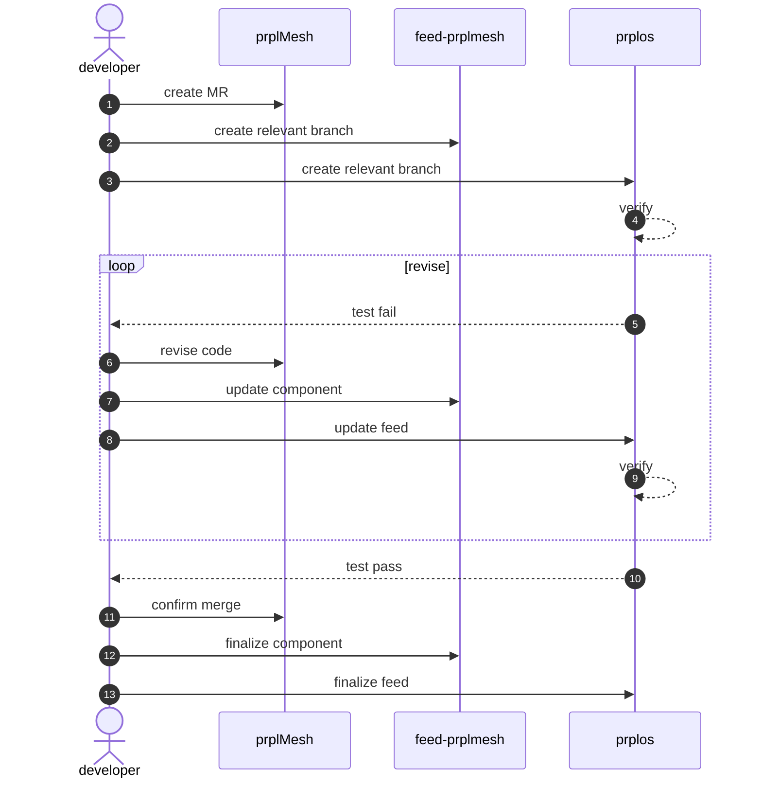
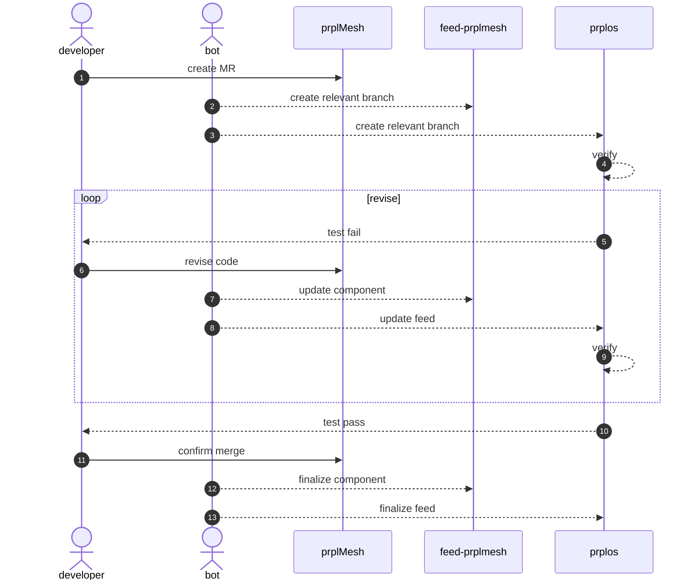

[TOC]

# prplOS CI component automatic feed

The manual procedures to update component level changes to the prplOS can be improved to an automatic way, which makes component integration easier under the [new automation work flow](https://prplfoundationcloud.atlassian.net/wiki/spaces/PRPLFOUN/pages/1056931845/Upcoming+workflow+automation+QA+and+CI+improvements) framework.


## work flow

The current procedures, using an example where `prplMesh`, `feed-prplmesh` and `prplos` act as component, feed and system level role accordingly, illustrated as below, where solid lines requires human involvement:



A bot can be deployed to do the component and feed updating tasks, the proposed procedures illustrated as below:




## CI implementation

The implementation includes multiple jobs running in component level and in system level, managed in a central place in prplOS.


### central management

component level CI pipeline includes remote template from prplOS

```yaml
include:
  - remote: 'https://gitlab.com/prpl-foundation/prplos/prplos/-/raw/main/ci/.component-integration.yml'
```


### component feed

Component feeding will be handled by a bot invoked by `merge_request_event` on protected branch in components, it create and update corresponding branches in feed level and system level, with predictable and unique branch name.

```yaml
component-feed:
  stage: integration
  needs: component-level-build
  rules:
    - if: $CI_PIPELINE_SOURCE == "merge_request_event" && $CI_MERGE_REQUEST_TARGET_BRANCH_NAME == $CI_DEFAULT_BRANCH
  tags:
    - bot-runner
  script:
    - bot.sh branch="${CI_PROJECT_NAME}/${CI_MERGE_REQUEST_IID}"
```

The combination of `CI_PROJECT_NAME` and `CI_MERGE_REQUEST_IID` is unique. The bot will create or update the `branch` in feed level and system level.


### component test

Merge request on component level needs to be verified by system level CI, to avoid introducing breaking changes to other components or to the system. The test job is invoked on component level, but the actually pipeline is defined in prplOS in a multi-project context.

a. component level CI

```yaml
component-test:
  stage: integration
  needs:
    - component-feed
  trigger:
    project: 'prpl-foundation/prplos/prplos'
    branch: "${CI_PROJECT_NAME}/${CI_MERGE_REQUEST_IID}"
    strategy: depend
```

b. system level CI

```yaml
component-test:
  stage: integration
  rules:
    - if: $CI_PIPELINE_SOURCE == "pipeline" && $CI_BRANCH_NAME matches pattern
      when: always
    - when: never
  script:
    - run test cases
```


## administration

### bot account

An account named `prplfoundation_bot` who serves a developer role in gitlab prpl-foundation space, managed by `Frederik Van Bogaert`.

### multiple-project setting

prplOS should allow (which does not equal to accept, using filter in pipeline) triggers coming from feed repositories' CI, and feed repositories CI should allow trigger coming from component CI, by enable the gitlab `Settings --> CI/CD --> Job token permissions --> CI/CD job token allowlist`, under **who's** management.

### runner

A gitlab runner which respond to specific tag (`bot-runner` in previous example) managed by **Maarten?**, it holds the credential of the bot account. The purpose of a specific runner is to avoid accountability risk, and it will only execute operations defined in the protected branch. 

Further explain: *user who triggers the pipeline has the same or even higher privilege level than the bot, the problem is the attacker can then hide under the cover of the bot account. store the credential in runner instead of in gitlab ci environment, in the mean time the bot only execute operations defined by the protected branch.*


## demo show case

https://gitlab.com/prpl-foundation/prplmesh/prplMesh/-/pipelines/1771605970